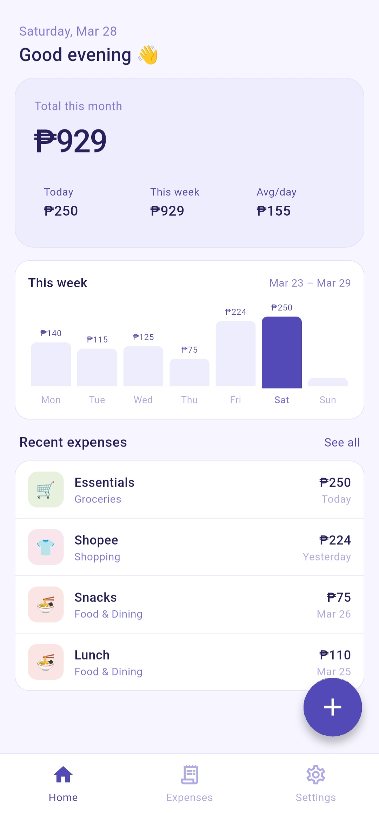
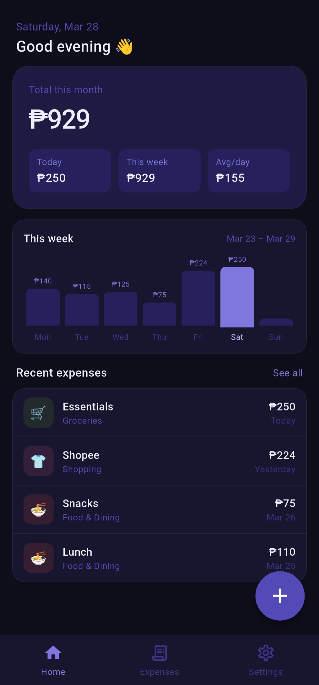
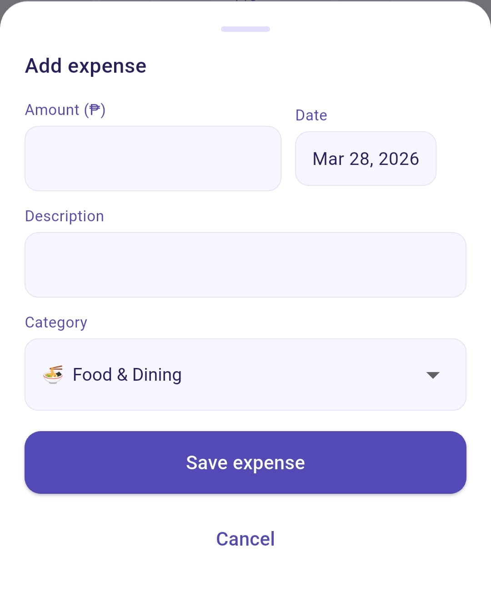
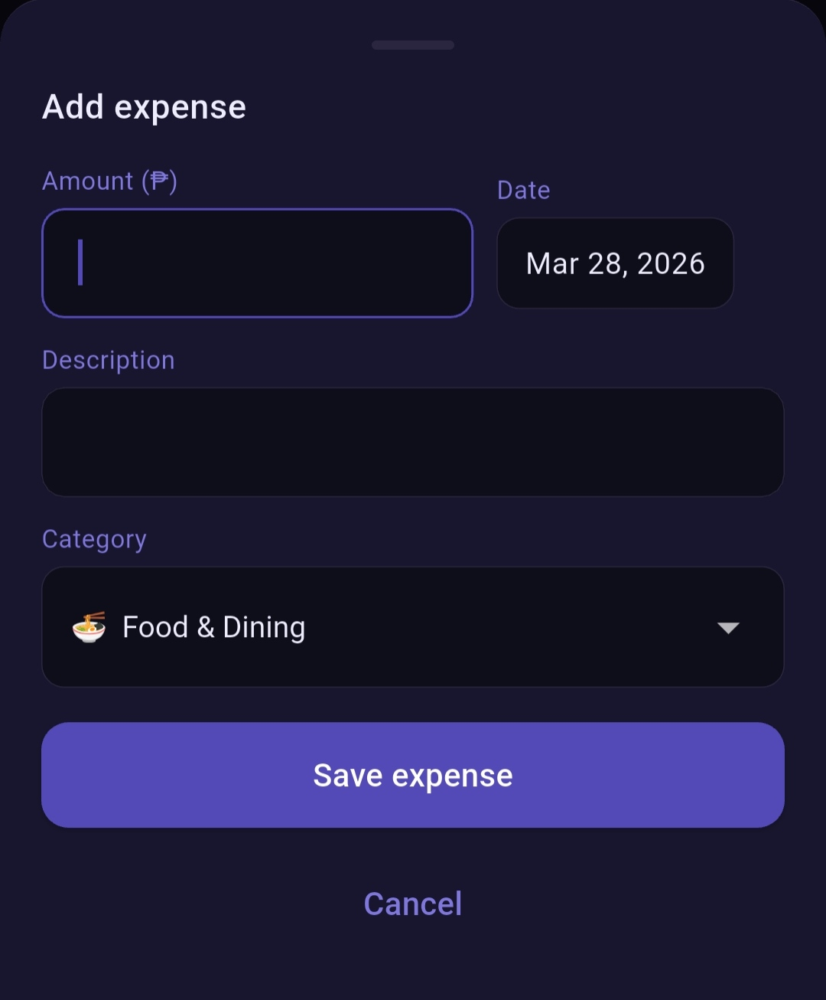
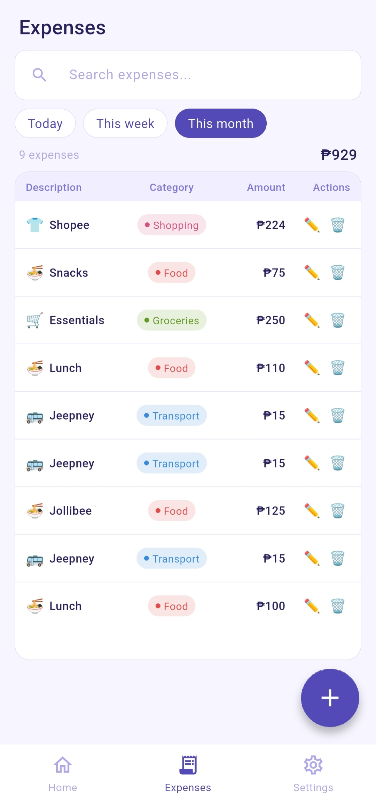
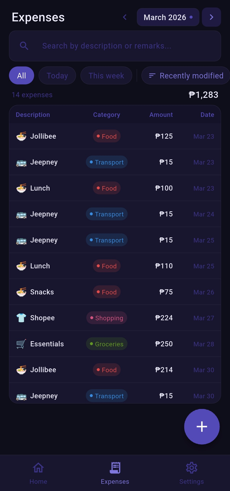
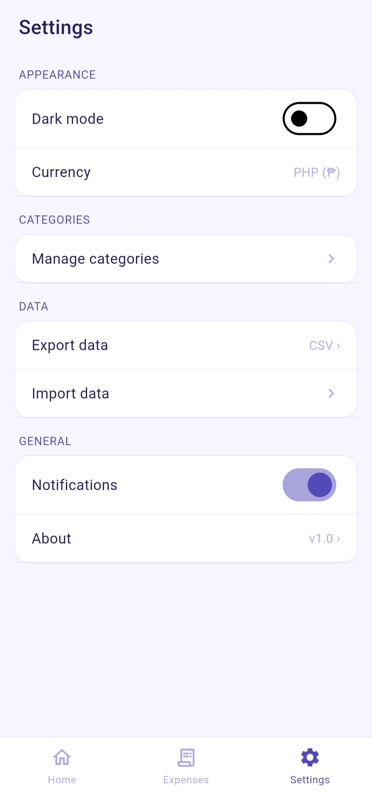
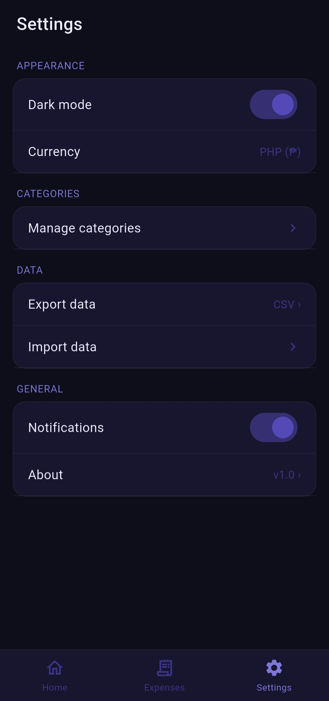

# expense-tracker-personal-project alpha
A mobile application expense tracker that helps users monitor their expenses, analyze their spending habits, and stay within budget. Users can add, edit, and delete expenses, and view totals (Other features will soon be added). Built with Flutter and Hive for offline data storage, it’s designed for anyone who wants an easy and intuitive way to manage personal finances. A personal project by me to practice my skills. 

**Technical Description**

_Platform:_ Flutter

_UI/UX:_ Dashboard, Expense List, Anaytics Screen

_Core Features:_  

    Add/delete/edit expenses
    Expense list with search and filter
    Daily/ monthly totals
    
_Additional Features (soon to be added):_ 
                                          
    Analytics (charts and insights)
    Budget Tracking/Limit

# 📱 GastosFlow Beta

---

## 📥 Download APK

👉 

---

## 🚀 Version 1.0 Released!

The first version of the Expense Tracker beta app is now available 🎉  

This release focuses on the **core features** needed for tracking and managing expenses in a simple and efficient way.

---

## ✨ Core Features Included

### 🏠 Home Page
- Weekly view of expenses  
- Daily, weekly, and monthly total spending  
- Average spending per day  
- Recent expenses overview  
- Quick access to add expense (available throughout the app)  

### 📋 Expenses Tab
- Search expenses by description or category  
- Filter by time (Today / This Week / This Month)  
- Complete expenses list  
- View total expenses (count and amount)  
- Edit and delete expenses  

### ⚙️ Settings

#### Appearance
- Dark mode  
- Currency support (PHP only for now)  

#### Categories
- Manage expense categories  

#### Data
- Export data (CSV)  
- Import data *(coming soon)*  

#### General
- Notifications *(coming soon)*  

📱 Available on Android (APK download)  
🍎 iOS version not available (no Mac environment)

---

### v1.0.1
#### 🔄 Changes
- Renamed app to **GastosKo**

#### 🛠️ Improvements
- Updated UI labels and branding

## 🔮 Upcoming Features

Additional features are currently in development and will be added in future updates, including advanced analytics, notifications, and improved data management.

## 📸 Screenshots

### 🏠 Home
| Light | Dark |
|------|------|
|  |  |

### ➕ Add Expense
| Light | Dark |
|------|------|
|  |  |

### 📋 Expense List
| Light | Dark |
|------|------|
|  |  |

### ⚙️ Settings
| Light | Dark |
|------|------|
|  |  |