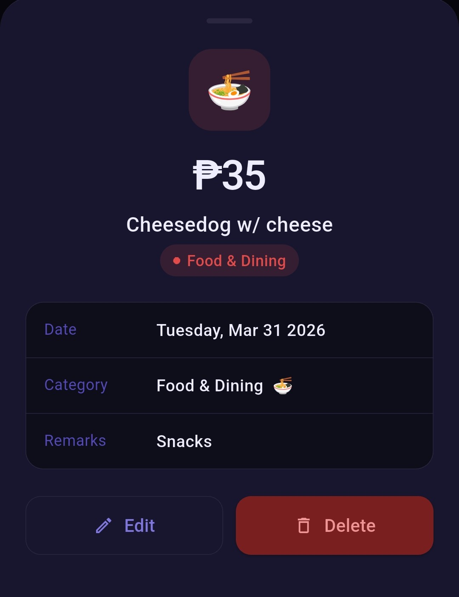
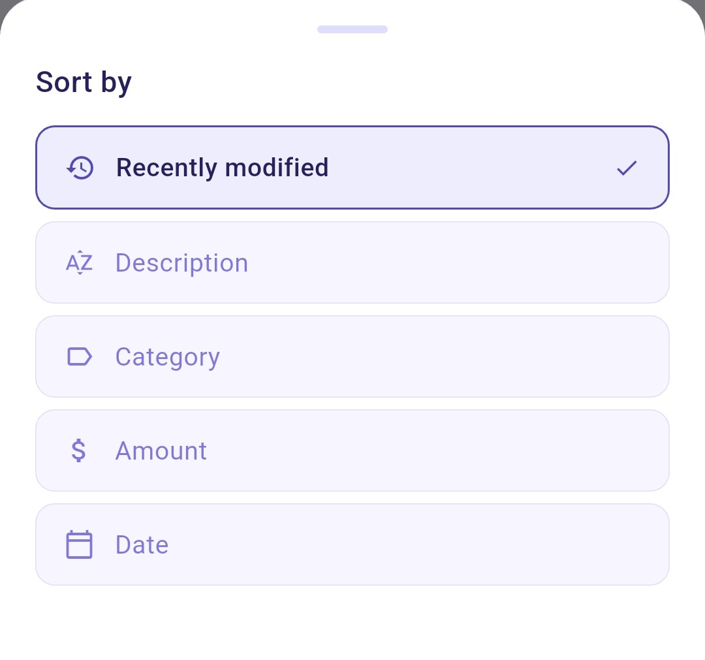
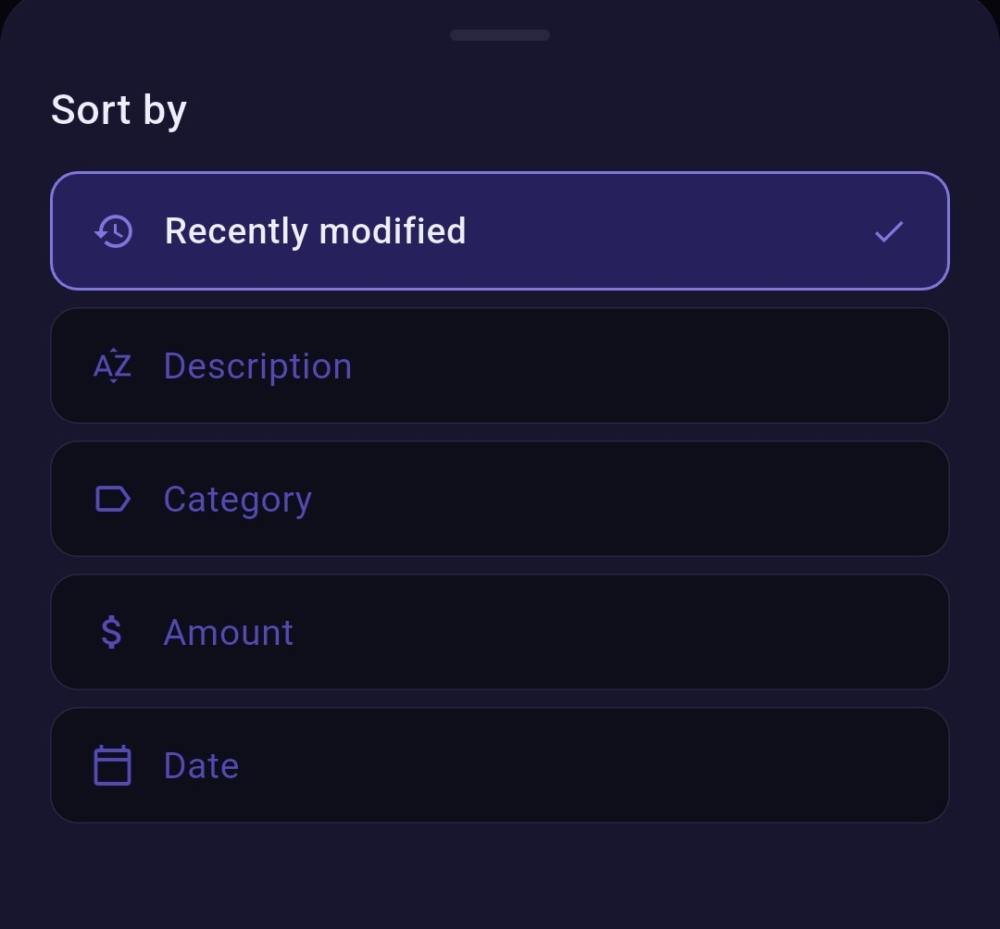
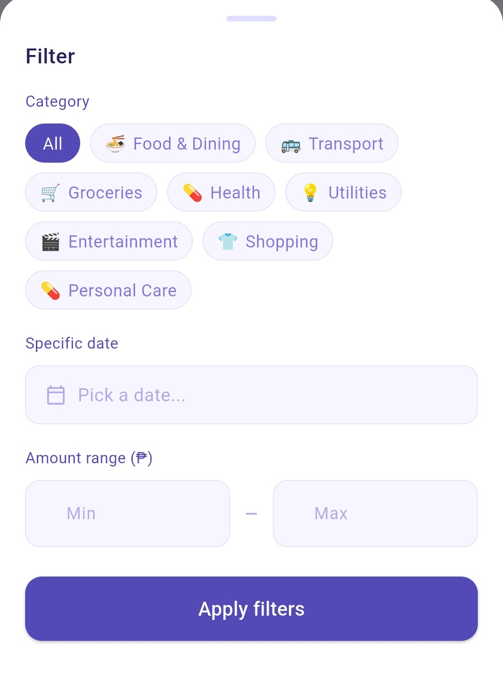
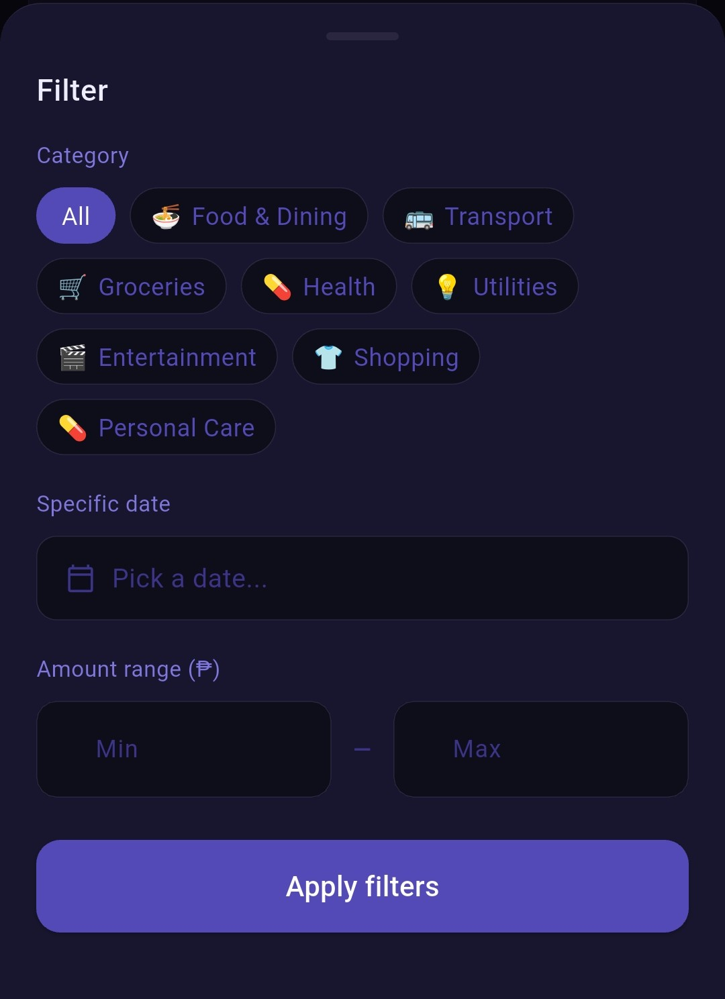
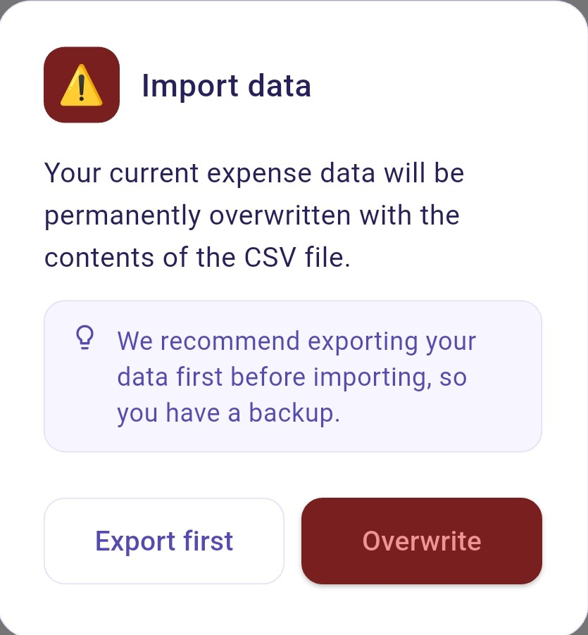
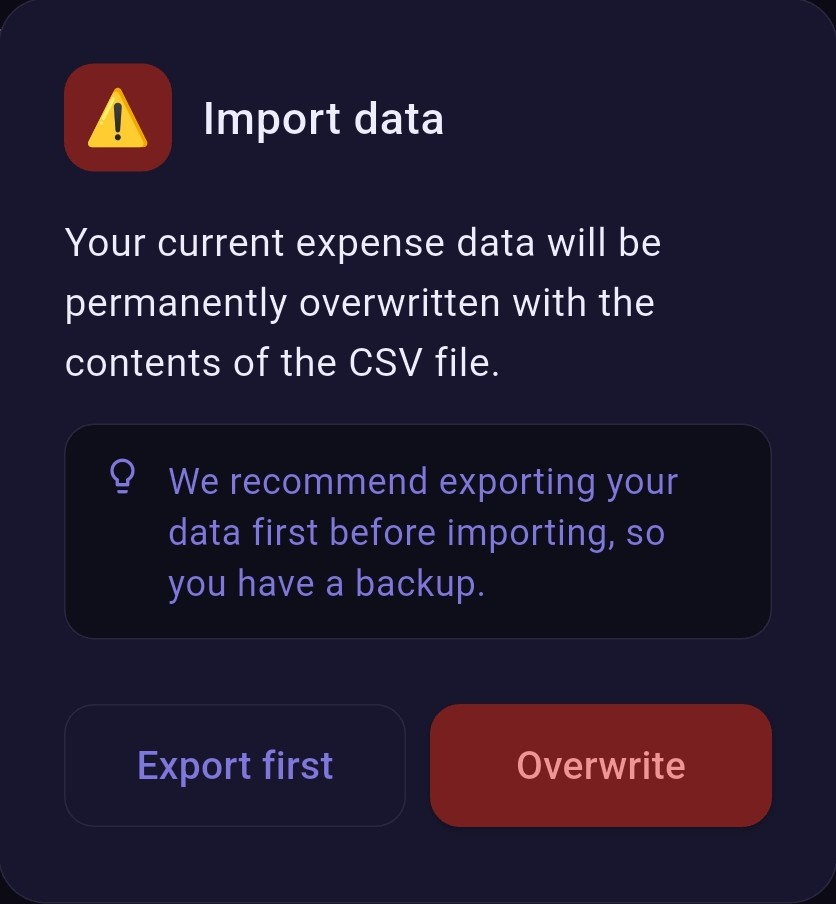

#  GastosFlow

GastosFlow is a simple mobile app for tracking and managing daily expenses. It allows users to add, edit, and organize expenses while viewing totals by day, week, and month. The app includes search, filters, category management, and dark mode for a better user experience.

Built with Flutter and using local storage, it works fully offline and is designed as a personal project to showcase mobile development skills and UI design.

---

## 📥 Download APK

👉 

---

## 📸 Screenshots

### 🏠 Home
| Light | Dark |
|------|------|
|  |  |

### ➕ Add Expense
| Light | Dark |
|------|------|
|  |  |

### 📋 Expense List
| Light | Dark |
|------|------|
|  |  |

### ℹ️ Details Screen
| Light | Dark |
|------|------|
|  |  |

### ⇅ Sorting Screen
| Light | Dark |
|------|------|
|  |  |

### ☷ Filtering Screen
| Light | Dark |
|------|------|
|  |  |

### ⚙️ Settings
| Light | Dark |
|------|------|
|  |  |

### 📢 Import Warning
| Light | Dark |
|------|------|
|  |  |

---

## 📝 Changelog

### v1.1.0

#### ✨ New Features
- Added **remarks** when adding expenses  
- Expenses can now be **tapped to view full details**  
- Added **sorting options**:
  - Recently modified (default)
  - Description
  - Category
  - Amount
  - Date  
- Added **filter options**:
  - By category
  - By specific date
  - By amount range  
- Added **month navigator** to browse previous months  
- Added **data import feature** (CSV support)  

#### 🔄 Improvements
- Updated **Expenses Tab layout**:
  - Removed Action column → replaced with **Date column**
  - Edit and Delete actions moved to **details screen**  
- Updated **search functionality**:
  - Now searches only **description and remarks**
- Updated **sub-filter chips**:
  - Now shows: *All / Today / This Week*  
- Exporting data now:
  - Saves as **CSV file**
  - Automatically creates a **GastosFlow folder** in internal storage  

#### ⚠️ Behavior Changes
- Importing data will:
  - Show a warning before overwriting existing data  
  - Recommend exporting current data first  

#### 🧹 Cleanup
- Removed default/sample data on first install  

#### 🎨 UI / Branding
- Updated **app icon**

---

### v1.0.1
#### 🔄 Changes
- Renamed app to **GastosFlow**

#### 🛠️ Improvements
- Updated UI labels and branding

---

## 🚀 Initial Release (v1.0) 

This release focuses on the **core features** needed for tracking and managing expenses in a simple and efficient way.
- Dashboard
- Daily, weekly, and monthly overview of expenses
- Expense List
- Add/Edit/Delete expenses

---

## ✨ Features

### 🏠 Dashboard
- Weekly overview of expenses  
- Daily, weekly, and monthly total spending  
- Average daily spending  
- Recent expenses preview  
- Quick access to add a new expense  

---

### ➕ Expense Management
- Add, edit, and delete expenses  
- Add **remarks/notes** for each expense  
- Tap an expense to view **full details**  
- Manage expenses in a clean and organized interface  

---

### 📋 Expenses Tab
- View complete list of expenses  
- Search by **description or remarks**  
- Sort expenses by:
  - Recently modified  
  - Description  
  - Category  
  - Amount  
  - Date  
- Filter expenses by:
  - Category  
  - Specific date  
  - Amount range  
- Navigate between months using **Month Navigator**  
- View total expense count and amount  

---

### ⚙️ Customization & Settings
#### Appearance
- Dark mode support  
- Currency support (PHP)

#### Categories
- Create, edit, and manage expense categories  

---

### 💾 Data Management
- Export data as **CSV file**  
- Import data from CSV (overwrites existing data with confirmation)  
- Automatic folder creation (**GastosFlow**) in device storage  

---

### 📱 General
- Fully offline functionality  
- Fast and lightweight performance  
- Clean and intuitive UI   

---

## 🔮 Upcoming Features

Additional features are currently in development and will be added in future updates, including advanced analytics, notifications, and improved data management.

---

## 📌 Notes

📱 Available on Android (APK download)  
🍎 iOS version not available (no Mac environment)

---

## 💬 Community & Feedback

We’d love to hear your thoughts and feedback! Join the discussions below:

---

### 💡 Feature Requests

Have an idea to improve GastosFlow? Share your feature suggestions, new tools, or enhancements here.

👉 [Join Feature Requests](https://github.com/paoloww-mi/expense-tracker-personal-project/discussions/1)

---

### 🐞 Bug Reports

Encountered a bug or unexpected behavior? Please report it here.

Include details like steps to reproduce, screenshots (if possible), and your environment so we can fix issues faster.

👉 [Report a Bug](https://github.com/paoloww-mi/expense-tracker-personal-project/discussions/2)

---

### ❓ Questions & Support

Need help using GastosFlow? Ask questions here.

This is a space for guidance, clarifications, and general support. The community or maintainers will try to help you out.

👉 [Ask a Question](https://github.com/paoloww-mi/expense-tracker-personal-project/discussions/3)

---

### 📢 Announcements

Stay updated with the latest releases, updates, and important news about GastosFlow.

👉 [View Announcements](https://github.com/paoloww-mi/expense-tracker-personal-project/discussions/4)

---

## 🤝 Contributing

We welcome contributions! Feel free to:
- Suggest improvements
- Report issues
- Help answer questions

Thank you for helping improve GastosFlow 🚀